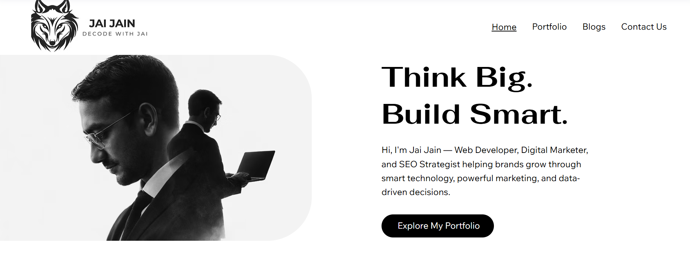
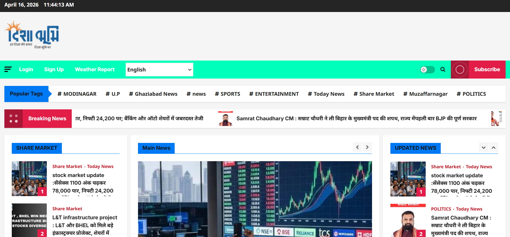
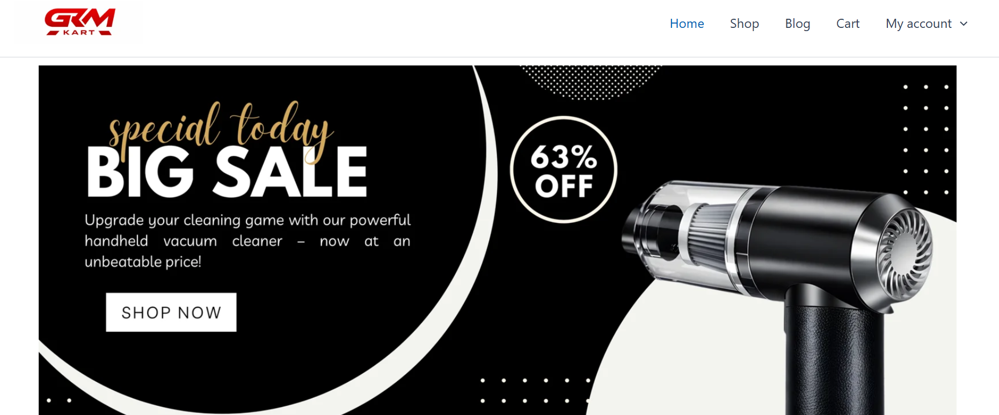
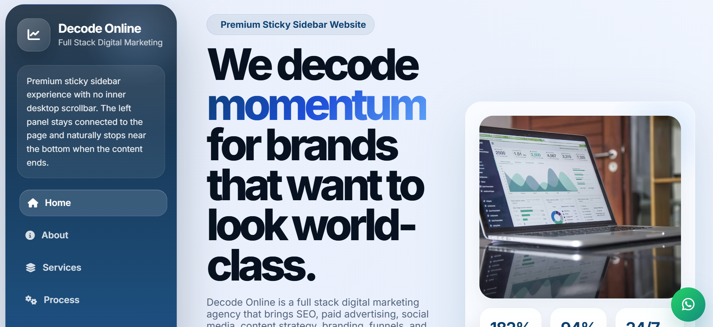

  

<h1 align="center">👋 Hi, I'm Jai Jain</h1>

🚀 Digital Builder • 💻 Web Developer • 📈 Performance Marketer • 🤖 AI Enthusiast

I build websites, scale digital products, and combine development, marketing, and AI to create real-world impact.

  
  
  

  
  
  
  

---

## 🌐 Live Presence

- 💼 LinkedIn: https://www.linkedin.com/in/-jai-jain/  
- 🌐 Portfolio: https://jaijainofficials.wixstudio.com/jaijain  
- 🎥 YouTube: https://www.youtube.com/@JaiJainDev  
- 🚀 Brand: Decode With Jai  

---

## 🧠 About Me

I’m a **multi-skilled digital creator** blending:

- 💻 Development  
- 📈 Performance Marketing  
- 🤖 AI & Automation  

to build **scalable digital systems & products**.

🎓 Completed **Data Science Program (GUVI)**  
🚀 Focused on **Web Dev + Full Stack Marketing**  
💡 Building blogs, affiliate systems & startup ideas  

---

## ✨ What I Do

- 💻 Build modern, responsive websites  
- 📈 Run & optimize Google Ads & Meta Ads  
- 🔍 Execute SEO strategies  
- 💰 Scale affiliate marketing systems  
- 🤖 Automate workflows using AI  
- 🛠️ Build real-world digital products  

---

## 🛠️ Tech Stack

**Development:** HTML, CSS, JavaScript, Bootstrap, WordPress  
**Data:** Python, SQL, Power BI, Tableau  
**Marketing:** SEO, Google Ads, Meta Ads, Affiliate Marketing  
**AI:** Prompt Engineering, Automation Tools  
**Others:** Git, GitHub, Blogging, Startup Thinking  

---

## 💼 Featured Projects

- 📰 Disha Bhoomi News Website  
- 🛒 GRMKART E-Commerce Store  
- 🌐 Portfolio Website  
- 🔢 Calculator App  

---

## 📸 Project

  
    
  
    
  
    
  

---

## 📊 GitHub Stats

  
  

  

---

## ⚙️ Usage

- Replace **your-username** with your GitHub username  
- Add real screenshots later  
- Keep updating projects & achievements  

---

## 🔥 Current Focus

- 🌐 Websites & blogs  
- 📈 SEO + Ads growth  
- 💰 Affiliate monetization  
- 🚀 Startup building  
- 🤖 AI integration  

---

## 🚀 Future Plans

- 🤖 AI automation systems  
- 🌐 SaaS tools  
- 📈 Advanced funnels  
- 🎥 Content creation  

---

## 👨‍💻 Author

**Jai Jain**

- LinkedIn: https://www.linkedin.com/in/-jai-jain/  
- Portfolio: https://jaijainofficials.wixstudio.com/jaijain  
- YouTube: https://www.youtube.com/@JaiJainDev  

---

## 💬 Support

⭐ Follow  
🤝 Connect  
📢 Share  

---

🔥 Building • Learning • Scaling — Every Day

  

